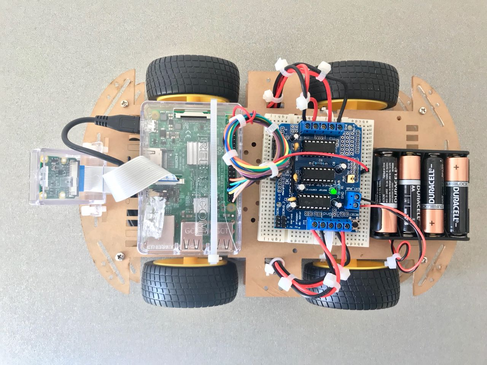
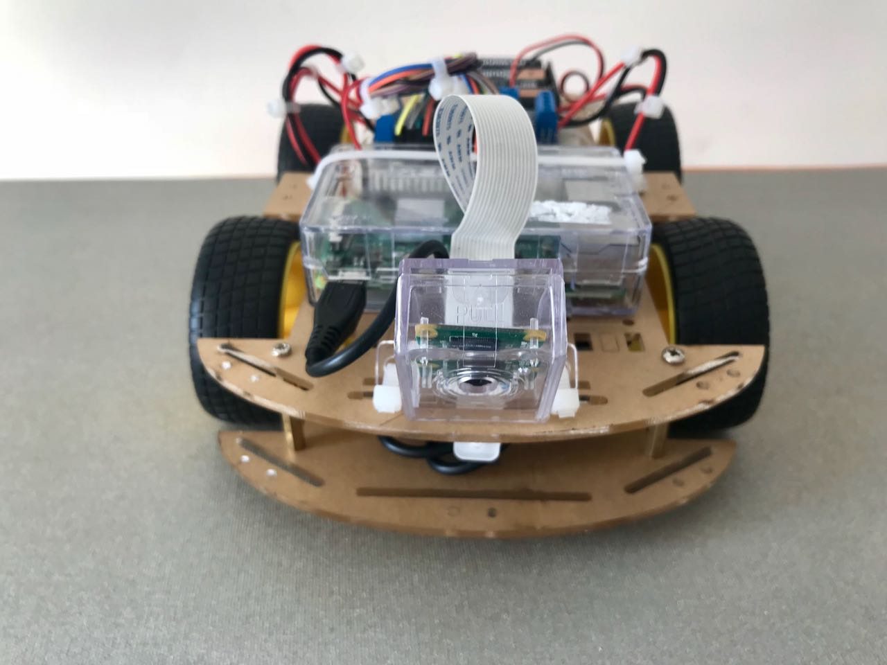
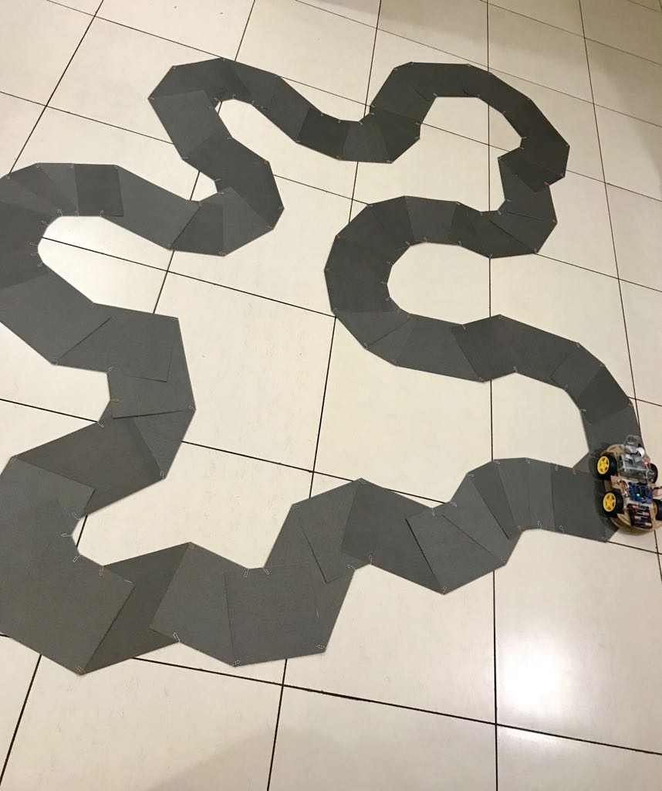

# Self Driving Remote Control Car
 

## Components
- Raspberry PI Model 3B ([link](https://www.amazon.in/gp/product/B01G882L3G))
- Raspberry PI Camera ([link](https://www.amazon.in/gp/product/B01HPJUO0O))
- Arduino Motor Shielf ([link](https://www.amazon.in/gp/product/B01NA82N88))
- Robocar Chasis ([link](https://www.amazon.in/gp/product/B01ANE9DXW))
- Breadboard and Jumper Wires ([link](https://www.amazon.in/gp/product/B071ZGMT4X))
- SD Card ([link](https://www.amazon.in/gp/product/B06Y5XBL8C))
- Power bank for mobile

In addiion below accessories are good to have
- Zip Wire ([link](https://www.amazon.in/gp/product/B074J4KF81))
- Solder Wire ([link](https://www.amazon.in/gp/product/B06XCKPXGN))
- Soldering Iron ([link](https://www.amazon.in/gp/product/B00ICIIS5Q))
- PI Camera Case ([link](https://www.amazon.in/gp/product/B00IJZJKK4))
- PI Case ([link](https://www.amazon.in/gp/product/B0110J9QFY))

## Setting Up
1. Setup PI: Download and install Raspbian
2. Assemble car
3. Configure Motor Shield ([link](https://github.com/lipoja/AMSpi))

## Track Setup

## Capturing Training Data
- script ([link](train.py))

## Training
- Random Forest Model: ([link](analyse.ipynb))
- Fully Connected Neural Net: ([link](tf_fully_connected.ipynb))
- Multilayer Perceptron: ([link](tf_nn_mlp.ipynb))
- Convolution Neural Net

## Running Car
- [rf_client.py](rf_client.py) (run on PI)
- [rf_server.p](rf_server.py) (run on Laptop)

## References
This post from Zheng Wang's is really good ([link](https://zhengludwig.wordpress.com/projects/self-driving-rc-car/)). His car can detect obstacles and traffic light.
